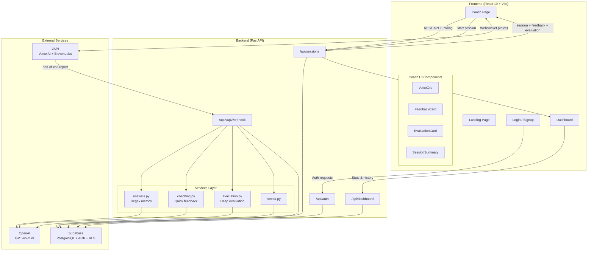
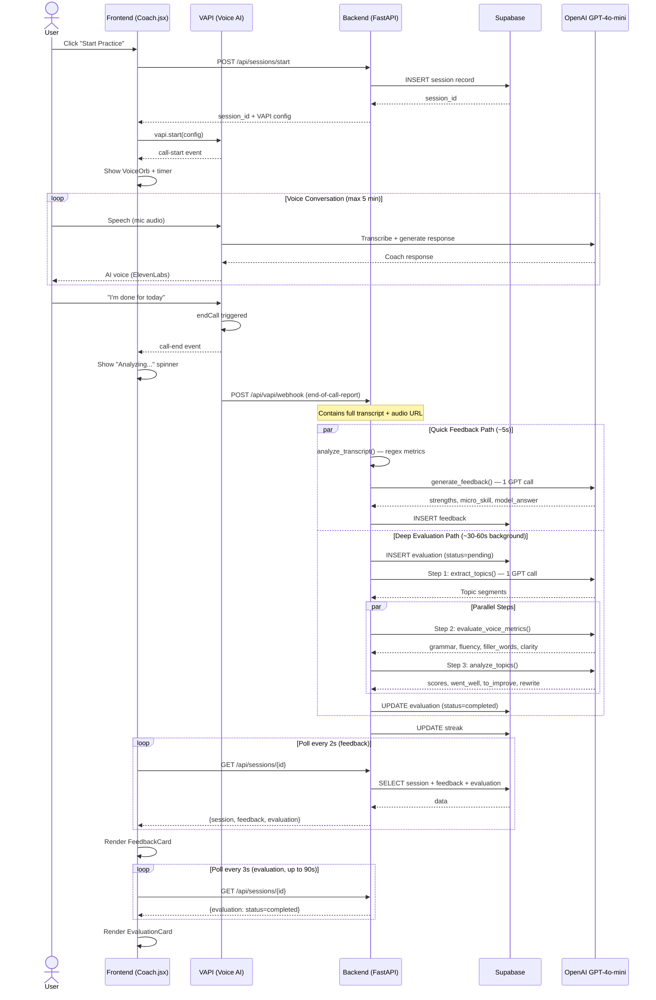
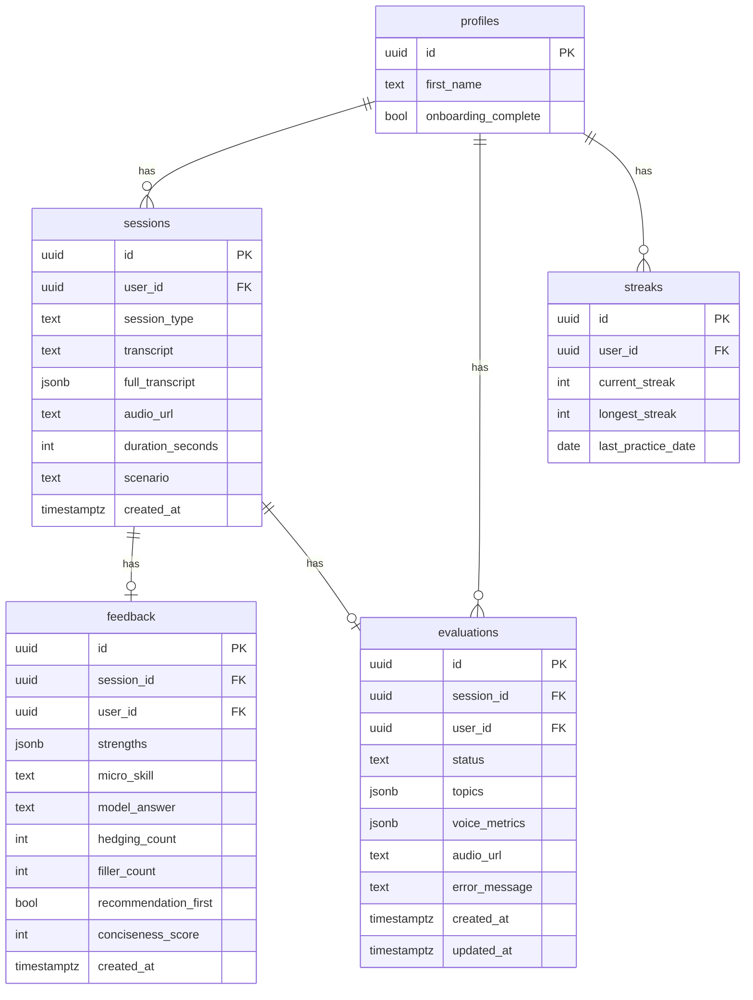

# EchoEval

AI-powered communication coaching platform that helps professionals practice and improve their speaking skills through real-time voice conversations with an AI coach, followed by multi-layered feedback and deep evaluation.


---

## Table of Contents

- [Features](#features)
- [Architecture](#architecture)
- [Tech Stack](#tech-stack)
- [Project Structure](#project-structure)
- [Getting Started](#getting-started)
- [Environment Variables](#environment-variables)
- [Database Setup](#database-setup)
- [Running the App](#running-the-app)
- [API Reference](#api-reference)
- [Deep Evaluation Pipeline](#deep-evaluation-pipeline)

---

## Features

- **Voice-based coaching** — Practice communication scenarios (giving feedback, pitching ideas, saying no) with an AI coach via real-time voice calls
- **Instant feedback (~5s)** — Quick analysis with strengths, micro-skill to improve, and a model answer from a confident leader's perspective
- **Deep evaluation (~30-60s)** — Async background pipeline that produces topic extraction, voice/communication metrics (0-100 scores), and per-topic deep analysis
- **Streak tracking** — Daily practice streaks to build consistency
- **Session history** — Dashboard with stats, top strengths, and detailed session review
- **Progressive loading** — Deep evaluation loads below the instant feedback card as it completes

---

## Architecture

### System Overview



### Call Lifecycle



### Deep Evaluation Pipeline

```mermaid
flowchart LR
    subgraph Input
        T["Full Transcript<br/>(JSONB array)"]
        U["User Text<br/>(concatenated)"]
        A["Audio URL<br/>(if available)"]
    end

    subgraph Step1["Step 1: Topic Extraction"]
        R["Regex Pre-pass<br/>Scan for topic-ask patterns"]
        L1["GPT-4o-mini<br/>Clean labels + validate"]
        R --> L1
    end

    subgraph Step2["Step 2: Voice Metrics"]
        L2["GPT-4o-mini<br/>Text-based scoring"]
        G["Grammar (0-100)"]
        F["Fluency (0-100)"]
        FW["Filler Words (0-100)"]
        C["Clarity (0-100)"]
        L2 --> G & F & FW & C
    end

    subgraph Step3["Step 3: Topic Analysis"]
        L3["GPT-4o-mini<br/>Adaptive rubric"]
        S["6 Scores (0-100)"]
        WW["Went Well"]
        TI["To Improve"]
        MP["Missed Points"]
        RW["Model Rewrite"]
        L3 --> S & WW & TI & MP & RW
    end

    subgraph Output["Evaluation Record"]
        DB[("Supabase<br/>evaluations table")]
    end

    T --> R
    T --> L1
    U --> L2
    L1 -->|"topics"| L3

    Step2 & Step3 --> DB

    style Step1 fill:#1e1b4b,stroke:#6366f1
    style Step2 fill:#1a2332,stroke:#34d399
    style Step3 fill:#2d1f0e,stroke:#fbbf24
    style Output fill:#1e1b4b,stroke:#818cf8
```



### Database Schema



### Data Flow

1. User clicks **Start Practice** → frontend creates a session via `POST /api/sessions/start`
2. VAPI Web SDK starts a real-time voice call with the AI coach (Alexa)
3. User practices a communication scenario; call ends (user says "done" or 5-min limit)
4. VAPI sends `end-of-call-report` webhook → backend stores transcript + kicks off both pipelines
5. **Quick feedback** stored in ~5s → frontend polls and renders FeedbackCard
6. **Deep evaluation** completes in ~30-60s → frontend polls and renders EvaluationCard

---

## Tech Stack

| Layer     | Technology                                      |
| --------- | ----------------------------------------------- |
| Frontend  | React 19, Vite 7, Tailwind CSS 4, React Router 7 |
| Backend   | Python 3.11+, FastAPI, Uvicorn                  |
| Database  | Supabase (PostgreSQL + Auth + RLS)               |
| AI        | OpenAI GPT-4o-mini                               |
| Voice     | VAPI (real-time voice AI + ElevenLabs TTS)       |

---

## Project Structure

```
EchoEvalFresh/
├── backend/
│   ├── main.py                    # FastAPI app entry point
│   ├── config.py                  # Environment variable loading
│   ├── migration_evaluation.sql   # DB migration for deep eval system
│   ├── models/
│   │   └── schemas.py             # Pydantic request/response models
│   ├── routers/
│   │   ├── auth.py                # Authentication endpoints
│   │   ├── dashboard.py           # Dashboard data aggregation
│   │   ├── sessions.py            # Session CRUD + VAPI call config
│   │   └── vapi_webhook.py        # VAPI webhook handler + system prompt
│   └── services/
│       ├── analysis.py            # Regex-based transcript analysis
│       ├── coaching.py            # GPT-4o-mini feedback generation
│       ├── evaluation.py          # Deep evaluation pipeline (3 steps)
│       ├── streak.py              # Daily streak calculation
│       └── supabase_client.py     # Supabase client initialization
├── frontend/
│   ├── src/
│   │   ├── main.jsx               # React entry point
│   │   ├── App.jsx                # Router configuration
│   │   ├── pages/
│   │   │   ├── Landing.jsx        # Landing/marketing page
│   │   │   ├── Login.jsx          # Login page
│   │   │   ├── Signup.jsx         # Signup page
│   │   │   ├── AuthCallback.jsx   # OAuth callback handler
│   │   │   ├── Onboarding.jsx     # New user onboarding
│   │   │   ├── Coach.jsx          # Main practice interface
│   │   │   └── Dashboard.jsx      # Session history + stats
│   │   ├── components/
│   │   │   ├── VoiceOrb.jsx       # Animated voice visualization
│   │   │   ├── FeedbackCard.jsx   # Quick feedback display
│   │   │   ├── EvaluationCard.jsx # Deep evaluation display
│   │   │   ├── SessionSummary.jsx # Post-session summary wrapper
│   │   │   ├── StreakBadge.jsx    # Streak counter badge
│   │   │   └── ProtectedRoute.jsx # Auth guard component
│   │   ├── context/
│   │   │   └── AuthContext.jsx    # Auth state management
│   │   └── lib/
│   │       ├── api.js             # API client (fetch wrapper)
│   │       ├── vapi.js            # VAPI Web SDK initialization
│   │       └── supabase.js        # Supabase client initialization
│   └── package.json
└── README.md
```

---

## Getting Started

### Prerequisites

- **Python 3.11+**
- **Node.js 18+** and npm
- **Supabase** account with a project
- **OpenAI** API key
- **VAPI** account with API key and public key

### 1. Clone the repository

```bash
git clone https://github.com/your-username/echoeval.git
cd echoeval
```

### 2. Install dependencies

```bash
# Backend
cd backend
pip install -r requirements.txt

# Frontend
cd ../frontend
npm install
```

---

## Environment Variables

### Backend (`backend/.env`)

```env
SUPABASE_URL=https://your-project.supabase.co
SUPABASE_KEY=your-anon-key
SUPABASE_SERVICE_KEY=your-service-role-key
OPENAI_API_KEY=sk-your-openai-key
VAPI_API_KEY=your-vapi-api-key
VAPI_PUBLIC_KEY=your-vapi-public-key
FRONTEND_URL=http://localhost:5173
PORT=8000
```

### Frontend (`frontend/.env`)

```env
VITE_SUPABASE_URL=https://your-project.supabase.co
VITE_SUPABASE_ANON_KEY=your-anon-key
VITE_VAPI_PUBLIC_KEY=your-vapi-public-key
VITE_API_URL=http://localhost:8000
```

---

## Database Setup

### Required Tables

Run the following in your **Supabase SQL Editor**. The app expects these tables:

#### Core tables (initial setup)

```sql
-- profiles, sessions, feedback, streaks tables
-- (created during initial project setup)
```

#### Deep Evaluation migration

Run `backend/migration_evaluation.sql` in the Supabase SQL Editor:

```sql
ALTER TABLE sessions ADD COLUMN IF NOT EXISTS full_transcript JSONB;
ALTER TABLE sessions ADD COLUMN IF NOT EXISTS audio_url TEXT;

CREATE TABLE IF NOT EXISTS evaluations (
  id UUID PRIMARY KEY DEFAULT gen_random_uuid(),
  session_id UUID REFERENCES sessions(id) ON DELETE CASCADE,
  user_id UUID REFERENCES profiles(id) ON DELETE CASCADE,
  status TEXT NOT NULL DEFAULT 'pending'
    CHECK (status IN ('pending', 'processing', 'completed', 'failed')),
  topics JSONB,
  voice_metrics JSONB,
  audio_url TEXT,
  error_message TEXT,
  created_at TIMESTAMPTZ DEFAULT NOW(),
  updated_at TIMESTAMPTZ DEFAULT NOW()
);

CREATE INDEX IF NOT EXISTS idx_evaluations_session_id ON evaluations(session_id);
ALTER TABLE evaluations ENABLE ROW LEVEL SECURITY;
CREATE POLICY "Users can view own evaluations" ON evaluations
  FOR SELECT USING (auth.uid() = user_id);
```

### Row Level Security

All tables use Supabase RLS. The `evaluations` table policy ensures users can only read their own evaluation data. Backend uses the **service role key** to bypass RLS for server-side writes.

---

## Running the App

### Development

```bash
# Terminal 1 — Backend
cd backend
uvicorn main:app --reload --port 8000

# Terminal 2 — Frontend
cd frontend
npm run dev
```

The app will be available at **http://localhost:5173**.

### Production Build

```bash
cd frontend
npm run build    # outputs to frontend/dist/
```

---

## API Reference

| Method | Endpoint                        | Description                          |
| ------ | ------------------------------- | ------------------------------------ |
| POST   | `/api/auth/signup`              | Create account                       |
| POST   | `/api/auth/login`               | Email/password login                 |
| POST   | `/api/auth/google`              | Google OAuth                         |
| GET    | `/api/auth/me`                  | Get current user profile             |
| GET    | `/api/sessions`                 | List user's sessions                 |
| GET    | `/api/sessions/{id}`            | Get session + feedback + evaluation  |
| POST   | `/api/sessions/start`           | Create session + get VAPI config     |
| POST   | `/api/sessions/complete-onboarding` | Mark onboarding done             |
| GET    | `/api/dashboard`                | Aggregated stats, streaks, strengths |
| POST   | `/api/vapi/webhook`             | VAPI call lifecycle events           |
| GET    | `/api/health`                   | Health check                         |

---

## Deep Evaluation Pipeline

The deep evaluation runs as a background async task after each call ends. It produces richer analysis than the quick feedback path.

### Step 1 — Topic Extraction

- **Regex pre-pass** scans assistant messages for topic-ask patterns (`"what.*topic.*practice"`, `"go ahead"`, etc.)
- Segments the transcript between topic boundaries
- **1 GPT-4o-mini call** cleans up topic labels and validates segments

### Step 2 — Voice & Communication Metrics

- **1 GPT-4o-mini call** evaluates the user's text for:
  - Grammar (0-100)
  - Fluency (0-100)
  - Filler words (0-100)
  - Clarity (0-100)
- Each metric includes `positives` and `to_improve` arrays
- Audio/pronunciation scoring is stubbed for future GPT-4o multimodal support

### Step 3 — Per-Topic Deep Analysis

- **1 GPT-4o-mini call** with all topics batched
- Rubric adapts dynamically based on topic type
- Per topic output:
  - 6 scores (structure, opening impact, key message clarity, persuasiveness, confidence, audience awareness)
  - Went well (2-3 items with transcript quotes)
  - To improve (2-3 concrete suggestions)
  - Missed points (2-4 elements a strong communicator would cover)
  - Model rewrite (3-4 sentence version)

Steps 2 and 3 run **in parallel** after Step 1 completes.

### Frontend Rendering

- **Pending/processing**: Animated spinner with progress bar
- **Failed**: Silently hidden
- **Completed**: Animated score bars (color-coded), expandable metric details, accordion per topic with scores grid, went-well/to-improve/missed-points lists, and model rewrite

---

## License

MIT
# EchoEval
